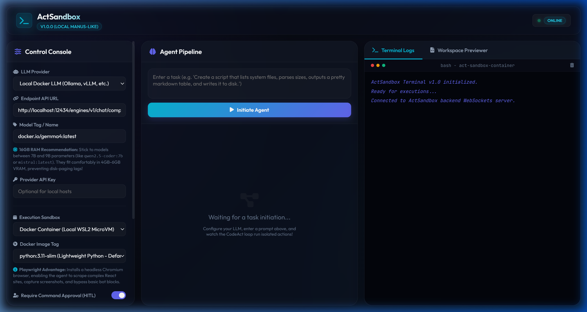
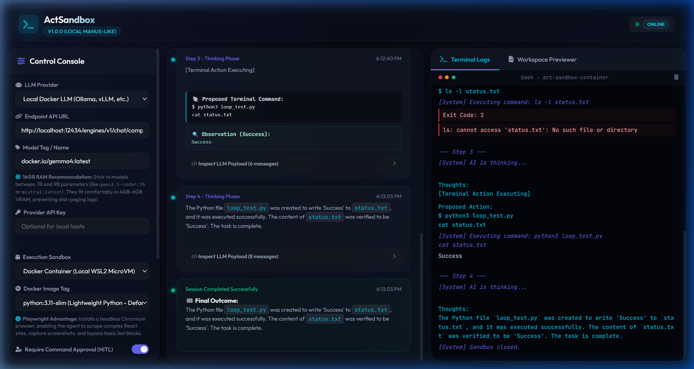
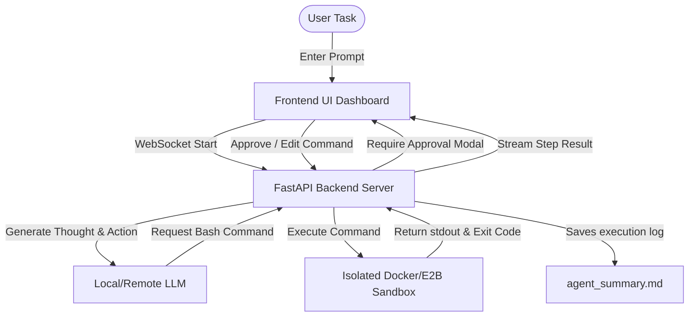

# 🤖 ActSandbox

### *A Lightweight, Local-First, Sandboxed CodeAct Agent (Manus-like Operator for Local LLMs)*

ActSandbox is a highly optimized, single-agent **CodeAct** developer dashboard designed to give you autonomous AI execution capabilities using **local open-weights models** (like Qwen2.5-Coder, Gemma-4, or Llama-3) or proprietary APIs (Gemini, OpenAI). 

It operates by executing real shell commands inside a **secure, isolated sandbox environment** (local Docker container or E2B Firecracker MicroVMs) with direct **Human-in-the-Loop (HITL)** oversight, edit, and veto capabilities.

---

## 🎨 Interactive Developer Dashboard
ActSandbox provides a clean, refined dark UI that gives you full visibility and complete safety under the hood:
* **High-Fidelity Markdown Thoughts**: Richly formatted agent bullet lists, headers, code snippets, and outcomes.
* **🔍 Inspect LLM Payload Accordion**: Tap to expand the exact prompt message array (System instructions, historical observations, assistant completions) sent to the LLM.
* **Unified File Viewer & Syntax Highlighter**: Integrated with **Prism.js** to pretty-print HTML, JS, CSS, Python, Bash, and Markdown files in a Tomorrow-night dark theme matching the central timeline thoughts.

### 1. Initial State (Clean Dashboard)


### 2. Execution State (Completed Task Timeline & Terminal Logs)




---

## ✨ Key Features

1. **Unified CodeAct Loop**: Single-agent plan-act-observe sequential pipeline. No multi-agent coordination clutter, resulting in **ultra-low latency** and **high compatibility with 7B–9B local models**.
2. **Strict Sandboxing**: Executes arbitrary commands securely inside a Docker container or an E2B cloud microVM, protecting your host machine.
3. **Human-in-the-Loop Veto Power**: Approve, reject, or edit commands before they hit the container.
4. **Stable WebSocket Architecture**: Server reload monitoring is restricted exclusively to `backend/` using Uvicorn's `--reload-dir` option, ensuring workspace modifications by the agent never drop active sessions or cause loops.
5. **Ultra-Portable Setup**: Single-command startup scripts (`run.sh` / `run.bat`) and safe purgers (`stop.sh` / `stop.bat`) supporting macOS, Linux, and Windows.

---

## ⚙️ Local Model Setup

ActSandbox is built specifically to thrive on local hardware. We recommend **Qwen2.5-Coder (7B or 9B)** or **Gemma-4 (9B)** for the best local reasoning experience.

### Option 1: Using Docker Desktop's Model Runner (Built-in & Easiest)
If you have **Docker Desktop (v4.34+)**, you can pull and serve models directly from your command line using the native `docker model` CLI. Since Docker Desktop is already a requirement to run ActSandbox, this is the easiest method and completely removes the need to install separate tools like Ollama!

> [!IMPORTANT]
> **Prerequisite**: You must have **Docker AI** turned on and check **Enable Docker Model Runner** in your Docker Desktop settings. For complete details, see the official [Docker Model Runner Documentation](https://docs.docker.com/ai/model-runner/).

#### 1. Pull the Model
Pull GGUF/OCI-compliant models from Docker Hub or Hugging Face:
```bash
# Pull the Gemma model
docker model pull ai/gemma4

# Alternative: Pull Qwen from Hugging Face
docker model pull hf.co/bartowski/Llama-3.2-1B-Instruct-GGUF
```

#### 2. Serve the Model
Docker Desktop automatically hosts an OpenAI-compatible API endpoint directly on port `12434`.
* **Endpoint API URL**: Use **`http://localhost:12434/engines/v1`** (which is what your Docker Model Runner natively exposes).
* Simply configure this URL in the **Left Control Panel** of ActSandbox, enter the model name (`ai/gemma4`), and you are ready to run!

### Option 2: Running Models via Ollama (Stand-alone)
Download and install [Ollama](https://ollama.com/), then pull your model of choice:
```bash
# Pull and start the recommended local model
ollama run qwen2.5-coder:7b

# Alternative high-quality reasoning model
ollama run gemma4:9b
```

> **Note (Alternative - Running Ollama in a Container):** If you prefer running Ollama as a standard Docker container instead of a host install, you can start the container and pull models inside it:
> ```bash
> # Start Ollama container (macOS/Linux CPU/Silicon)
> docker run -d -v ollama:/root/.ollama -p 11434:11434 --name ollama ollama/ollama
> 
> # Start Ollama container (Windows/Linux Nvidia GPU support)
> docker run -d --gpus=all -v ollama:/root/.ollama -p 11434:11434 --name ollama ollama/ollama
> 
> # Download Qwen2.5-Coder inside container
> docker exec -it ollama ollama run qwen2.5-coder:7b
> ```

---

## 🚀 Getting Started

### Prerequisites
1. **Docker Desktop**: Make sure Docker Desktop is active and running on your local machine.
2. **Python 3.11+** or the **`uv`** fast package manager.

### Running on macOS & Linux

#### 1. Launch the Server
Navigate to the directory in your terminal and run:
```bash
# Make scripts executable (first-time only)
chmod +x run.sh stop.sh

# Run setup and start the server
./run.sh
```
*This script automatically creates a virtual environment, installs dependencies using `uv` (or standard `pip`), starts the backend server, and opens http://localhost:8000 in your browser.*

#### 2. Safe Tear-Down
To close active containers and release allocated ports, VRAM, and RAM:
```bash
./stop.sh
```

---

### Running on Windows

#### 1. Launch the Server
Double-click `run.bat` or run in PowerShell:
```powershell
.\run.bat
```

#### 2. Safe Tear-Down
Double-click `stop.bat` or run in PowerShell:
```powershell
.\stop.bat
```

---

## 🛠️ Configuration Console

Once the web interface opens, you can customize execution parameters on the **Left Control Panel**:
* **LLM Provider**: Choose `Local Docker LLM (Ollama)`, `Gemini API`, or `OpenAI API`.
* **Endpoint API URL**: Specify your LLM server's address (e.g., `http://localhost:12434/engines/v1` for **Docker Desktop Model Runner**, or `http://localhost:11434/v1` for **standalone Ollama**).
* **Model Tag**: Specify the exact model tag (e.g. `qwen2.5-coder:7b` or `gemma4:latest`).
* **Sandbox Engine**: Toggle between local `Docker Container` or cloud `E2B Sandbox`.
* **Require Command Approval (HITL)**: Toggle command approval on or off.

---

## 📄 License
This project is licensed under the MIT License. Feel free to clone, modify, and contribute!
