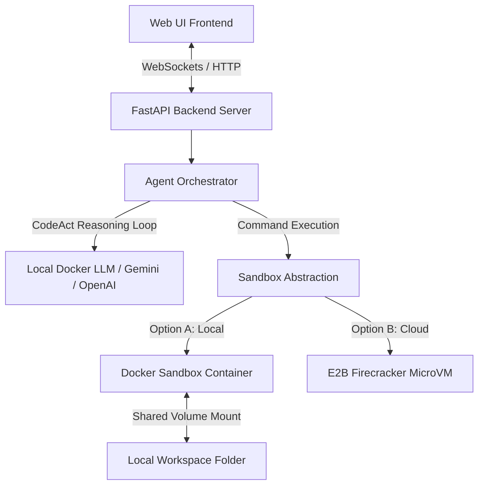

# Implementation Plan - ActSandbox (Local Manus-like CodeAct with MicroVM/Docker Sandboxing)

This plan outlines the architecture and implementation steps to build **ActSandbox**, a self-contained, local Manus-like AI agent system. ActSandbox utilizes the **CodeAct** pattern (Analyze → Plan → Execute in Sandbox → Observe) to run terminal commands inside an isolated environment. It features a stunning glassmorphic UI, streams real-time execution outputs, supports local Docker-hosted LLMs as first-class providers, and includes a refined **Human-in-the-Loop (HITL)** approval/editor control.

---

## User Review Required

> [!IMPORTANT]
> **Docker Desktop Requirement**:
> The local sandbox runs inside a Docker container (which acts as a secure, local microVM-equivalent running on WSL2). Docker Desktop must be running on your Windows 11 host. (We verified that Docker is currently **RUNNING** on your system!).
>
> **Local Docker LLMs Support**:
> To support your preference for running **free, locally hosted models** (like `docker.io/mistral:latest` or `docker.io/gemma4:latest` on Docker Desktop), the backend and UI will feature a **"Local Docker LLM"** option. This connects to any OpenAI-compatible API server running inside Docker Desktop (such as Ollama, vLLM, or Docker's native Model Runner).
>
> **Dual Sandbox Strategy**:
> - **Local Docker Sandbox**: Free, offline-compatible, mounts the workspace folder, and uses the host's WSL2 VM for execution.
> - **E2B Sandbox (Real Cloud Firecracker MicroVMs)**: If you possess an E2B API Key, you can enable E2B to run code inside cloud-isolated Firecracker microVMs. We provide a single configuration switch to toggle between them.

---

## Local LLM Setup Guide (Included in UI)

To run `mistral:latest` and `gemma4:latest` (or `gemma2`) locally inside your Docker Desktop, you can choose one of the following methods:

### Method A: Ollama Container (Highly Recommended & Easiest)
Run the official Ollama container on Docker Desktop:
```bash
docker run -d -v ollama:/root/.ollama -p 11434:11434 --name ollama ollama/ollama
```
Then, pull your models:
```bash
docker exec -it ollama ollama pull mistral
docker exec -it ollama ollama pull gemma2  # Or gemma
```
*In the ActSandbox UI, select "Local Docker LLM", set the API URL to `http://localhost:11434/v1`, and set the model to `mistral` or `gemma2`!*

### Method B: vLLM or Custom Inference Containers
If you run specific containerized model servers on Docker Desktop:
```bash
docker run -d -p 8000:8000 --name mistral-server vllm/vllm-openai:latest --model mistralai/Mistral-7B-Instruct-v0.3
```
*In the ActSandbox UI, set the API URL to `http://localhost:8000/v1` and set the model tag to match your server!*

---

## Proposed System Architecture

ActSandbox comprises a Python FastAPI backend and a gorgeous, responsive, glassmorphic vanilla HTML/JS/CSS frontend.



---

## Proposed Changes

### [Backend Component]
A robust Python web application managing sandboxes and executing the LLM CodeAct loop.

#### [NEW] [sandbox.py](file:///c:/Sourcecode/codeact/backend/sandbox.py)
Defines the `BaseSandbox` abstraction interface and implements:
- `DockerSandbox`: Uses the `docker` Python client. Starts an Ubuntu-based container, mounts the local `workspace/` directory to `/workspace` in the container, and runs bash scripts inside `/workspace`.
- `E2BSandbox`: Uses the `e2b` Python client to spawn cloud Firecracker microVMs and interact with them.

#### [NEW] [agent.py](file:///c:/Sourcecode/codeact/backend/agent.py)
Main agent module:
- Implements the asynchronous `CodeActAgent` execution loop.
- Manages conversational memory and formats system prompts prompting the model to use bash blocks.
- Parses LLM output for ```bash markdown blocks.
- Manages **Human-in-the-Loop** state: Pauses execution and asks the user for approval or modifications before running potentially risky terminal commands.
- Communicates with local Docker LLMs (Mistral/Gemma), Gemini, or OpenAI using the standardized `openai` Python SDK (supporting custom base URLs and model tags).

#### [NEW] [app.py](file:///c:/Sourcecode/codeact/backend/app.py)
The web server module:
- Serves the static HTML/CSS/JS frontend.
- Exposes REST API endpoints to load/save configuration, view files, and list workspace documents.
- Establishes a WebSocket endpoint `/ws` to stream agent operations (thoughts, executions, command output, phase changes) to the client.

#### [NEW] [requirements.txt](file:///c:/Sourcecode/codeact/backend/requirements.txt)
Python package requirements:
- `fastapi`, `uvicorn`, `websockets`, `pydantic`, `docker`, `openai`, `google-genai`, `e2b` (optional).

---

### [Frontend Component]
A highly polished, clean, glassmorphic dashboard showcasing live thoughts, interactive terminals, and a visual workspace file viewer.

#### [NEW] [index.html](file:///c:/Sourcecode/codeact/frontend/index.html)
The structure of the main control dashboard:
- **Control Bar**: Select LLM provider (Local Docker LLM, Gemini, OpenAI), custom API URL (e.g. `http://localhost:11434/v1`), model tags (`mistral`, `gemma4:latest`, etc.), and toggles for "Require Command Approval".
- **Interactive Workspace Explorer**: Lists files in the agent's active folder, and features a glowing visual preview panel for files (images, code, tables).
- **Agent Pipeline Timeline**: Vertical timeline rendering thought cards with micro-animations and status badges (e.g. "🧠 Thinking", "🐚 Running Bash", "🕒 Pending Approval").
- **Live Terminal Monitor**: Ultra-sleek, dark terminal console printing standard output and stderr in real-time.

#### [NEW] [style.css](file:///c:/Sourcecode/codeact/frontend/style.css)
The style definitions:
- Modern typography (Inter and JetBrains Mono fonts fetched from Google Fonts).
- HSL-curated colors (Dark Mode slate background `#0f172a`, glowing neon cyan accents, deep violet highlights).
- Glassmorphic card styling (`backdrop-filter: blur(12px); border: 1px solid rgba(255,255,255,0.08)`).
- Animations: pulsating borders for active states, smooth transition slides, fade-ins for terminal messages.

#### [NEW] [app.js](file:///c:/Sourcecode/codeact/frontend/app.js)
Frontend logic:
- Connects to backend WebSocket.
- Renders thoughts, commands, and outputs sequentially in the terminal and pipeline timeline.
- Handles human-in-the-loop action approvals (Approve, Reject, or Edit Command).
- Manages workspace file explorer actions (clicking files to fetch content and display in code previewer).

---

### [Setup and Orchestration]

#### [NEW] [run.bat](file:///c:/Sourcecode/codeact/run.bat)
A convenient command-line script for Windows to:
1. Create a python virtual environment `.venv` using the extremely fast package manager `uv`.
2. Install all required dependencies from `requirements.txt`.
3. Start the FastAPI backend server on `http://localhost:8000`.
4. Open the user's browser to the dashboard automatically.

---

## Verification Plan

### Automated Tests
1. Run server validation using a shell script to start `app.py` and ping API endpoints (`/api/config`, `/api/files`).
2. Run standard Python test scripts to confirm Docker sandbox container spins up, maps the workspace directory correctly, and captures shell outputs.

### Manual & Interactive Verification
1. Start an Ollama or vLLM container on Docker Desktop running `mistral:latest` or `gemma2`.
2. Open the UI in Chrome/Edge, configure "Local Docker LLM" with the local endpoint and model name.
3. Run a test task (e.g., "Install pandas, create a dataset of 5 random numbers, compute the mean, and write it to summary.txt").
4. Validate that the workspace folder `workspace/` gets the new file `summary.txt` created, and that the UI workspace panel lists it in real-time.
5. Toggle "Require Command Approval" and test the HITL workflow. Modify a command in the UI before approving, and verify the agent executes the edited command.
